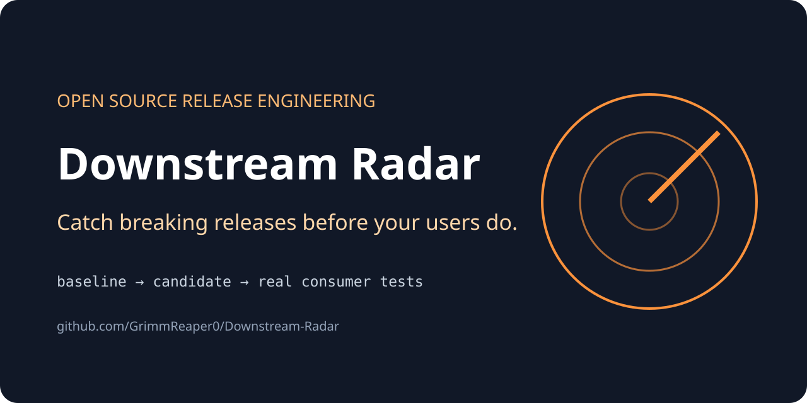
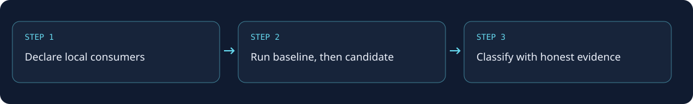

# Downstream Radar

**Test a release against the projects that depend on it.**



[](https://github.com/GrimmReaper0/Downstream-Radar/actions/workflows/ci.yml)
[](pyproject.toml)
[](LICENSE)

Your library's tests can pass while a consumer breaks. Downstream Radar runs a
**declared set of consumer tests twice**: against a baseline package, then your
candidate. It finds new regressions without blaming the candidate for failures
that were already present.

**0.1.0 scope:** local manifests, independent temporary workspaces, explicit
setup/test commands, baseline-aware classification, parallel jobs, JSON evidence
and Markdown summaries. Automatic dependency discovery and hosted ecosystem-wide
testing are not part of this release.

## Install from source

Requires **Python 3.11+ on Linux or macOS**. No third-party Python runtime
dependencies. This is a source release, not an advertised PyPI publication.

```sh
git clone https://github.com/GrimmReaper0/Downstream-Radar.git
cd Downstream-Radar
python3 -m venv .venv
. .venv/bin/activate
python -m pip install .
downstream-radar --help
```

## Find an intentional breaking change

```sh
downstream-radar run examples/radar.toml --trust \
  --baseline examples/packages/v1 --candidate examples/packages/v2 \
  --json artifacts/radar.json --markdown artifacts/radar.md
```

Two real Python consumers are tested. Integer addition still works; a legacy
consumer passing numeric strings breaks. The command intentionally exits **1**:
one compatible consumer and one regression.

Compare the baseline with itself for a passing run:

```sh
downstream-radar run examples/radar.toml --trust \
  --baseline examples/packages/v1 --candidate examples/packages/v1 \
  --json artifacts/unchanged.json
```

## Declare your consumers

```toml
version = 1

[[projects]]
name = "my-consumer"
path = "consumers/my-consumer"
test = ["{python}", "test_consumer.py"]
```

Consumer paths are relative to the manifest. Baseline/candidate paths are relative
to the calling shell. Each test receives a copied package through `RADAR_PACKAGE`.
Arguments can use `{python}`, `{package}` and `{workspace}` placeholders.
`setup = [["command", "argument"]]` declares installation/build steps explicitly;
commands do not pass through a shell unless you request a shell executable.

The Python demo inserts `RADAR_PACKAGE` into `sys.path`. For other ecosystems,
install the candidate inside the temporary consumer directory. The guide includes
an npm integration recipe. Toolchains and downloads remain your responsibility;
the harness does not invent commands from a repository.

## Missing evidence is not compatibility

| Result | Meaning |
| --- | --- |
| compatible | Baseline and candidate tests passed. |
| regression | Baseline passed; candidate tests completed and failed. |
| baseline-failed | Baseline tests already failed. |
| baseline-unavailable | Baseline setup or execution was unavailable. |
| candidate-unavailable | Candidate setup or execution could not complete. |

Percentages cover only comparable results, with inconclusive counts always shown.
They describe your declared sample, **not the entire package ecosystem**.

Exit codes: **0** all compatible; **1** a regression; **2** invalid setup or
inconclusive results without a detected regression.

## Execution boundary

`--trust` authorizes local commands. Temporary copies are **not a sandbox**.
Use a disposable environment for third-party suites; never install globally in
setup. Credentials need explicit `--pass-env NAME`. Hidden configuration,
credential-like files, dependency directories and symlinks are not silently copied.

## How it works



## Development and support

```sh
python -m unittest discover -s tests -v
python scripts/smoke.py
```

See the [usage guide](docs/guide.md), [verification record](docs/testing.md),
[contribution guide](CONTRIBUTING.md), [security policy](SECURITY.md) and
[release notes](CHANGELOG.md). Report bugs with a small, sanitized reproduction.

Prepared GitHub descriptions, topics and social-preview instructions are in
[repository setup](docs/repository-setup.md). Licensed under [MIT](LICENSE).
